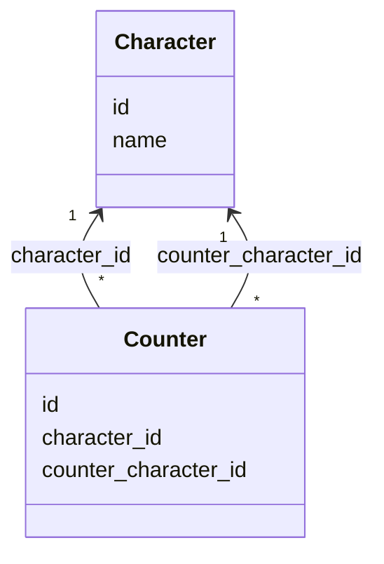

# Arkkitehtuurikuvaus

## Sovelluslogiikka

Sovelluksen logiikasta vastaavat luokat Character ja Counter.

```mermaid
 classDiagram
    Character "1" <-- "*" Counter : character_id
    Character "1" <-- "*" Counter : counter_character_id
    class Character{
        id
        name
    }
    class Counter{
        id
        character_id
        counter_character_id
    }
```
