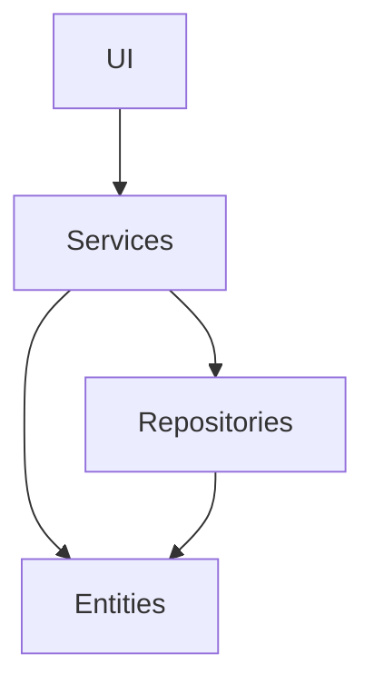
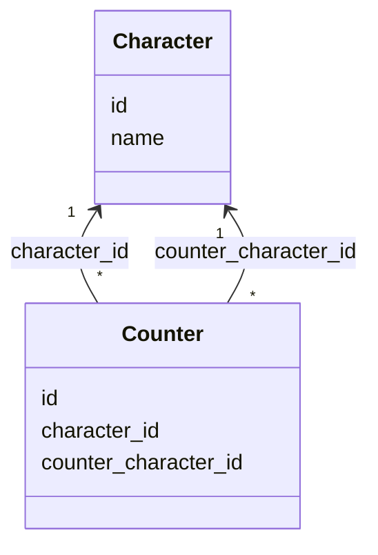
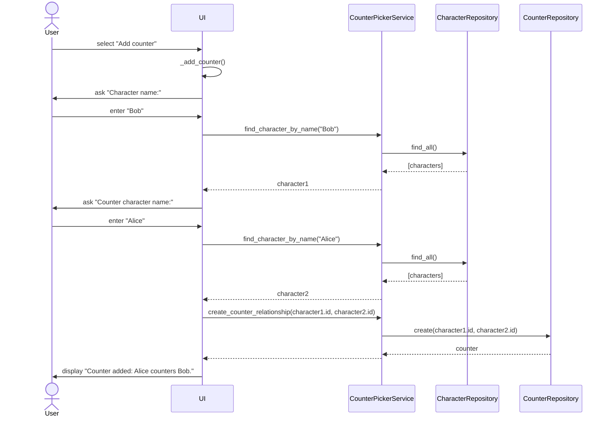
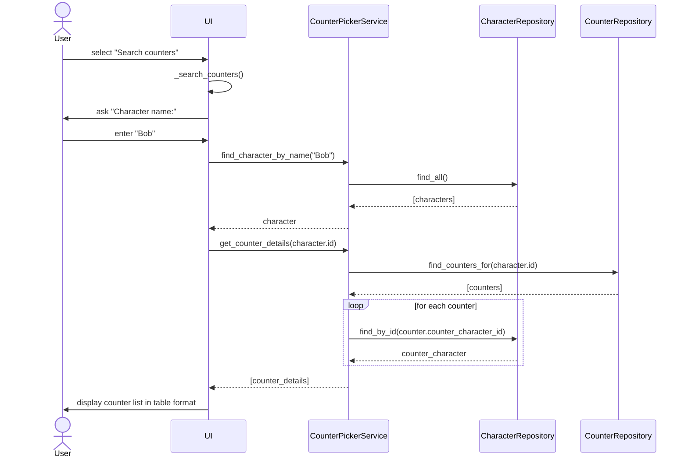

# Arkkitehtuurikuvaus

## Rakenne

Ohjelman rakenne noudattaa kolmitasoista kerrosarkkitehtuuria koodin pakkausrakenteen ollessa seuraavanlainen:

Pakkaus ui vastaa käyttöliittymästä, services sovelluslogiikasta ja repositories tietojen pysyväistallennuksesta. Pakkauksen entities luokat kuvastavat sovelluksen käyttämiä tietokohteita.

## Sovelluslogiikka

Sovelluksen logiikasta vastaavat luokat Character ja Counter.

Toiminnallisista kokonaisuuksista vastaa [CounterPickerService](src/services/counterpicker_service.py). Luokka tarjoaa metodeja käyttöliittymälle kuten:

- `create_character(name)`
- `get_all_characters()`
- `create_counter_relationship(character_id, counter_character_id)`
- `get_counter_details(character_id)`

_CounterPickerServicellä_ on pääsy hahmoihin ja vastavalintasuhteisiin luokkien [CharacterRepository](src/repositories/character_repository.py) ja [CounterRepository](src/repositories/counter_repository.py) kautta. Toteutukset injektoidaan sovelluslogiikalle luokan konstruktorikutsussa.

## Tietojen pysyväistallennus

Pakkauksen _repositories_ luokat `CharacterRepository` ja `CounterRepository` ovat vastuussa tietojen tallentamisesta SQLite-tietokantaan.

Luokat noudattavat repository-suunnittelumallia, jolloin ne ovat mahdollista korvata uusilla toteutuksilla, jos datan tallennustapaa halutaan vaihtaa.

## Päätoiminnallisuudet

Tässä kuvataan sovelluksen päätoiminnallisuuksien toimintalogiikkaa sekvenssikaavioina.

### Vastavalintasuhteen luominen

Ennen vastavalintasuhteen luomista, tulee luoda siihen lisättävät hahmot. Kaaviossa oletetaan, että käyttäjä on jo lisännyt sovellukseen hahmot Alice ja Bob.

UI hakee käyttäjän syöttämiä nimiä vastaavat hahmot CounterPickerRepositoryn kautta CharacterRepositorysta, annetaan hahmojen ID:t argumentteina CounterRepositoryn create-metodille, joka palauttaa counter-olion.

### Vastavalintojen hakeminen hahmolle

Kun hahmolle on lisätty vastavalintoja, niitä voidaan hakea:

UI hakee käyttäjän syöttämää nimeä vastaavan hahmon CounterPickerServicen kautta CharacterRepositorysta, noudetaan vastavalintahahmojen id:t listana CounterRepositorysta, CounterPickerService hakee id:eitten avulla hahmojen tiedot listana ja UI esittää ne visuaalisesti taulukoituna käyttäjälle.
