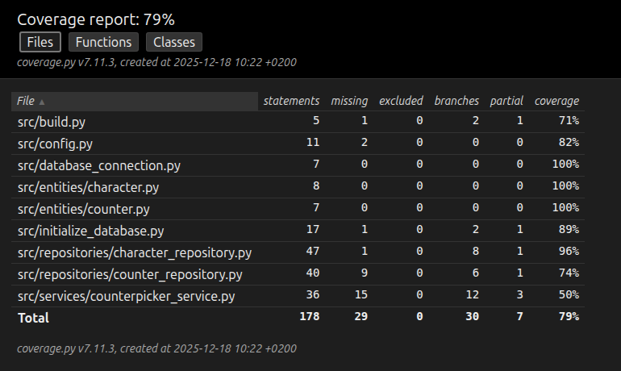

# Testausdokumentti

Ohjelmaa on testattu sekä automatisoiduin yksikkö- ja integraatiotestein unittestilla sekä manuaalisesti tapahtunein järjestelmätason testein.

## Yksikkö- ja integraatiotestaus

### Sovelluslogiikka

Sovelluslogiikasta vastaavaa `CounterPickerService`-luokkaa testataan [TestCounterPickerService](https://github.com/jkuusto/ot-harjoitustyo/blob/main/src/tests/counterpicker_service_test.py)-testiluokalla. Service-olio alustetaan niin, että sille injektoidaan `FakeCharacterRepository` ja `FakeCounterRepository` repositorio-oliot, jotka tallentavat tietoa muistiin.

### Repositorio-luokat

Repositorio-luokkia `CharacterRepository` ja `CounterRepository` testataan testitietokantaa käyttäen. Testitietokannan nimi on konfiguroitu _.env.test_-tiedostossa. `CharacterRepository`-luokka testataan [TestCharacterRepository](https://github.com/jkuusto/ot-harjoitustyo/blob/main/src/tests/character_test.py)-luokalla ja `CounterRepository`-luokkaa testataan [TestCounterRepository](https://github.com/jkuusto/ot-harjoitustyo/blob/main/src/tests/counter_test.py)-luokalla.

### Entiteetti-luokat

Entiteettiluokat `Character`ja `Counter` testataan tavanomaisilla yksikötesteillä käyttäen [TestCharacterEntity](https://github.com/jkuusto/ot-harjoitustyo/blob/main/src/tests/character_test.py) ja [TestCounterEntity](https://github.com/jkuusto/ot-harjoitustyo/blob/main/src/tests/counter_test.py)-luokkia.

### Testikattavuus

Sovelluksen testauksen haaraumakattavuus on dokumentointihetkellä 79 %.

Testaamatta on funktioiden ja metodien joitakin haaroja sekä services-moduulin get_counter_details()-metodi.

## Järjestelmätestaus

Sovelluksen järjestelmätestausta on suoritettu manuaalisesti.

### Asennus ja konfigurointi

Sovellusta on testattu [käyttöohjeen](./kayttoohje.md) kuvaamalla tavalla sekä WSL2- että Linux-ympäristössä.

### Toiminnallisuudet

[Määrittelydokumentin](./vaatimusmaarittely.md) valmiiksi merkityt ja käyttöohjeen listaamat toiminnallisuudet on läpikäyty. Toiminnallisuuksien syötekehotteisiin on yritetty syöttää myös virheellisiä arvoja kuten tyhjä.
