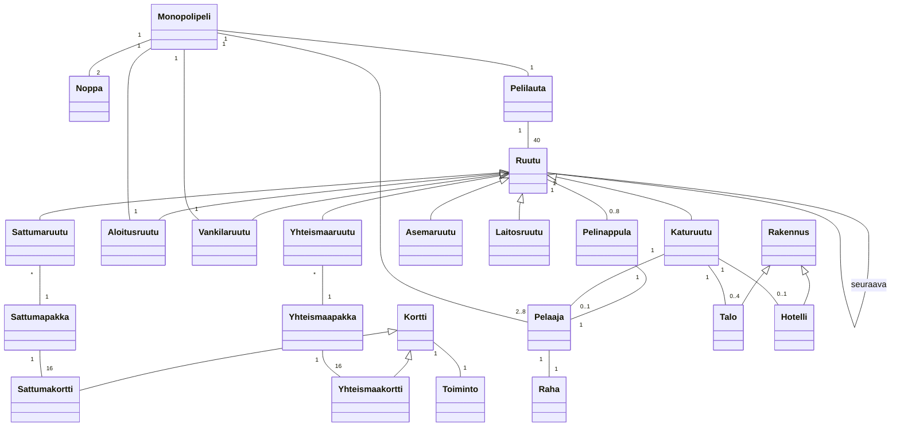

```mermaid
 classDiagram
    Monopolipeli "1" -- "2" Noppa
    Monopolipeli "1" -- "1" Pelilauta
    Pelilauta "1" -- "40" Ruutu
    Ruutu "1" -- "1" Ruutu : seuraava
    Ruutu "1" -- "0..8" Pelinappula
    Pelinappula "1" -- "1" Pelaaja
    Pelaaja "2..8" -- "1" Monopolipeli

    Ruutu <|-- Aloitusruutu
    Ruutu <|-- Vankilaruutu
    Ruutu <|-- Sattumaruutu
    Ruutu <|-- Yhteismaaruutu
    Ruutu <|-- Asemaruutu
    Ruutu <|-- Laitosruutu
    Ruutu <|-- Katuruutu

    Monopolipeli "1" -- "1" Aloitusruutu
    Monopolipeli "1" -- "1" Vankilaruutu

    Kortti <|-- Sattumakortti
    Kortti <|-- Yhteismaakortti
    Sattumaruutu "*" -- "1" Sattumapakka
    Sattumapakka "1" -- "16" Sattumakortti
    Yhteismaaruutu "*" -- "1" Yhteismaapakka
    Yhteismaapakka "1" -- "16" Yhteismaakortti
    Kortti "1" -- "1" Toiminto

    Rakennus <|-- Talo
    Rakennus <|-- Hotelli
    Katuruutu "1" -- "0..4" Talo
    Katuruutu "1" -- "0..1" Hotelli
    Katuruutu "1" -- "0..1" Pelaaja
    Pelaaja "1" -- "1" Raha
```
